# LeaveBoard - ARC42 Architecture Documentation

**Version:** 1.0
**Date:** February 2026
**Author:** Development Team
**Status:** Draft

---

## Table of Contents

1. [Introduction and Goals](#1-introduction-and-goals)
2. [Architecture Constraints](#2-architecture-constraints)
3. [System Scope and Context](#3-system-scope-and-context)
4. [Solution Strategy](#4-solution-strategy)
5. [Building Block View](#5-building-block-view)
6. [Runtime View](#6-runtime-view)
7. [Deployment View](#7-deployment-view)
8. [Cross-cutting Concepts](#8-cross-cutting-concepts)
9. [Architecture Decisions](#9-architecture-decisions)
10. [Quality Requirements](#10-quality-requirements)
11. [Risks and Technical Debts](#11-risks-and-technical-debts)
12. [Glossary](#12-glossary)

---

## 1. Introduction and Goals

### 1.1 Requirements Overview

**LeaveBoard** is a comprehensive vacation and absence tracking system designed to simplify the process of requesting, approving, and managing time off for employees and managers within organizations.

#### Primary Functional Goals
- **Employee Self-Service**: Enable employees to request vacation, sick leave, and other time off
- **Manager Approval Workflow**: Provide managers with tools to review, approve, or deny leave requests
- **Team Calendar Visibility**: Offer transparent view of team availability and planned absences
- **Leave Balance Management**: Track and calculate employee leave entitlements and balances
- **Administrative Control**: Enable HR teams to manage policies, users, and system configuration

#### Secondary Goals
- **Integration Capability**: Support integration with existing HR systems and identity providers
- **Notification System**: Provide email and in-app notifications for important events
- **Reporting and Analytics**: Generate reports on leave patterns and team availability
- **Mobile Accessibility**: Ensure system usability across desktop and mobile devices

### 1.2 Quality Goals

| Priority | Quality Goal | Motivation |
|----------|--------------|------------|
| 1 | **Usability** | System must be intuitive for both technical and non-technical users |
| 2 | **Reliability** | 99.5% uptime to ensure business continuity |
| 3 | **Security** | Protect sensitive employee data and prevent unauthorized access |
| 4 | **Performance** | Fast response times (&lt;2s) for common operations |
| 5 | **Maintainability** | Modular design to enable easy updates and feature additions |
| 6 | **Scalability** | Support growth from small teams to enterprise organizations |

### 1.3 Stakeholders

| Role | Expectations | Contact |
|------|-------------|---------|
| **Employees** | Easy-to-use interface for leave requests and calendar viewing | End Users |
| **Managers** | Efficient approval workflows and team visibility | Line Managers |
| **HR Teams** | Administrative controls and compliance reporting | HR Department |
| **System Administrators** | Reliable deployment and monitoring capabilities | IT Operations |
| **Developers** | Clean, maintainable codebase with good documentation | Development Team |

---

## 2. Architecture Constraints

### 2.1 Technical Constraints

| Constraint | Background and Motivation |
|------------|---------------------------|
| **Web-based Application** | Must be accessible via modern web browsers without plugin requirements |
| **PostgreSQL Database** | Organization standardized on PostgreSQL for data persistence |
| **Container Deployment** | Must support Docker containerization for consistent deployment |
| **TypeScript** | Type safety requirement for both frontend and backend development |
| **REST API** | Standard HTTP/REST interface for client-server communication |

### 2.2 Organizational Constraints

| Constraint | Background and Motivation |
|------------|---------------------------|
| **Open Source Libraries** | Preference for established open-source technologies to reduce licensing costs |
| **Cloud-Native Design** | Support deployment in cloud environments (AWS, Azure, GCP) |
| **Security Compliance** | Must meet standard enterprise security requirements (authentication, encryption) |
| **Development Team Size** | Small team requires maintainable, well-documented architecture |

### 2.3 Conventions

| Convention | Description |
|------------|-------------|
| **Coding Standards** | TypeScript with ESLint rules, Prettier formatting |
| **API Design** | RESTful services following OpenAPI specification |
| **Version Control** | Git with feature branch workflow |
| **Documentation** | Code documentation using JSDoc/TSDoc |

---

## 3. System Scope and Context

### 3.1 Business Context

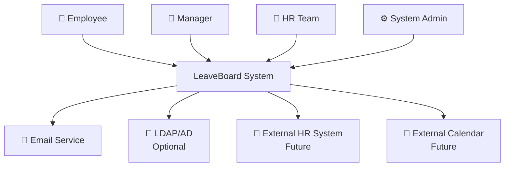

### 3.2 Technical Context

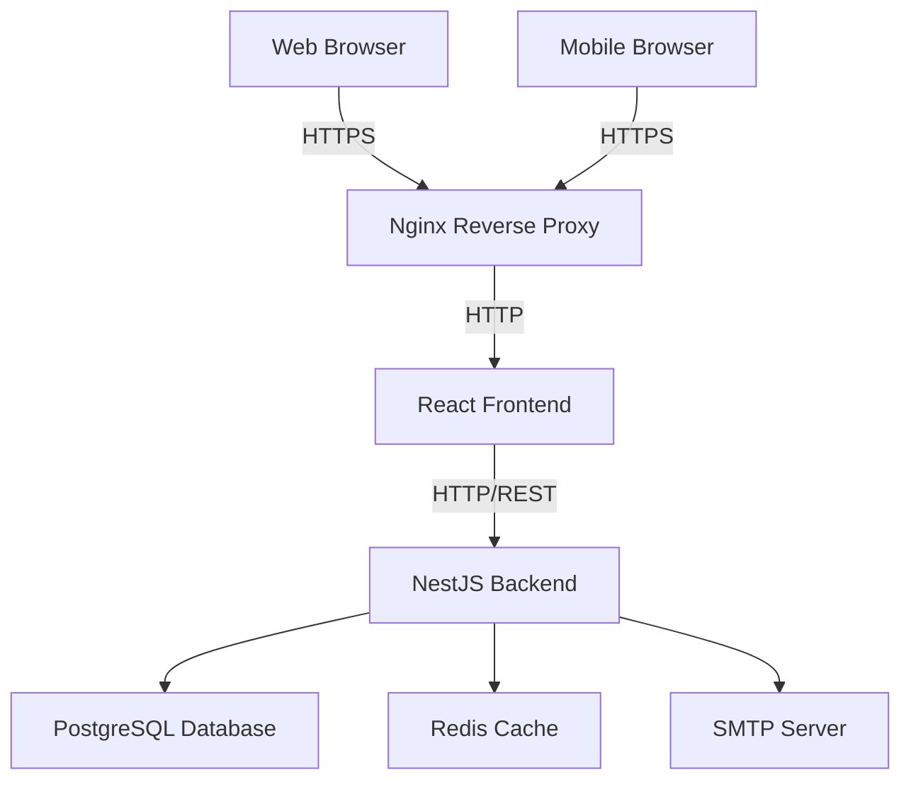

### 3.3 External Interfaces

| Interface | Type | Purpose |
|-----------|------|---------|
| **Web UI** | HTTP/HTTPS | Primary user interface for all user types |
| **REST API** | HTTP/JSON | Backend services for frontend consumption |
| **Database** | PostgreSQL | Data persistence layer |
| **Cache** | Redis | Session storage and performance optimization |
| **Email** | SMTP | Notification delivery |
| **LDAP/AD** | LDAP/S | Optional user authentication integration |

---

## 4. Solution Strategy

### 4.1 Technology Decisions

| Decision Area | Chosen Solution | Alternative Considered | Rationale |
|---------------|----------------|----------------------|-----------|
| **Frontend Framework** | React + TypeScript | Vue.js, Angular | Large community, team familiarity, ecosystem maturity |
| **Backend Framework** | NestJS | Express.js, Fastify | Enterprise features, TypeScript-first, modular architecture |
| **Database** | PostgreSQL | MySQL, MongoDB | ACID compliance, JSON support, enterprise features |
| **Authentication** | JWT + Passport.js | Auth0, Firebase Auth | Control over implementation, no vendor lock-in |
| **State Management** | Zustand + React Query | Redux Toolkit, Context API | Simplicity, built-in async handling |
| **Styling** | TailwindCSS | Material-UI, Styled Components | Utility-first approach, design system flexibility |
| **Build Tool** | Vite | Webpack, Parcel | Fast development builds, modern tooling |
| **Containerization** | Docker + Docker Compose | Kubernetes, Podman | Simplicity for development, easy local setup |

### 4.2 Architectural Patterns

#### 4.2.1 Overall Architecture
- **Layered Architecture**: Clear separation between presentation, business logic, and data layers
- **Microservices-Ready**: Modular backend design enables future service decomposition
- **API-First Design**: Backend exposes REST API consumed by multiple clients

#### 4.2.2 Backend Patterns
- **Module-based Architecture**: NestJS modules for feature organization
- **Repository Pattern**: Data access abstraction using TypeORM
- **Dependency Injection**: Loose coupling through NestJS DI container
- **Guard-based Security**: Authentication and authorization guards

#### 4.2.3 Frontend Patterns
- **Component-based Architecture**: Reusable React components
- **Container/Presentation Pattern**: Separation of logic and UI concerns
- **Custom Hooks**: Shared logic extraction
- **Context + Hooks**: Global state management

### 4.3 Top-level Decomposition

The system is decomposed into the following high-level components:

1. **Presentation Layer** (React Frontend)
2. **API Gateway** (Nginx Reverse Proxy)
3. **Application Layer** (NestJS Backend)
4. **Data Layer** (PostgreSQL + Redis)
5. **External Services** (Email, Optional LDAP)

---

## 5. Building Block View

### 5.1 Level 1 - System Overview

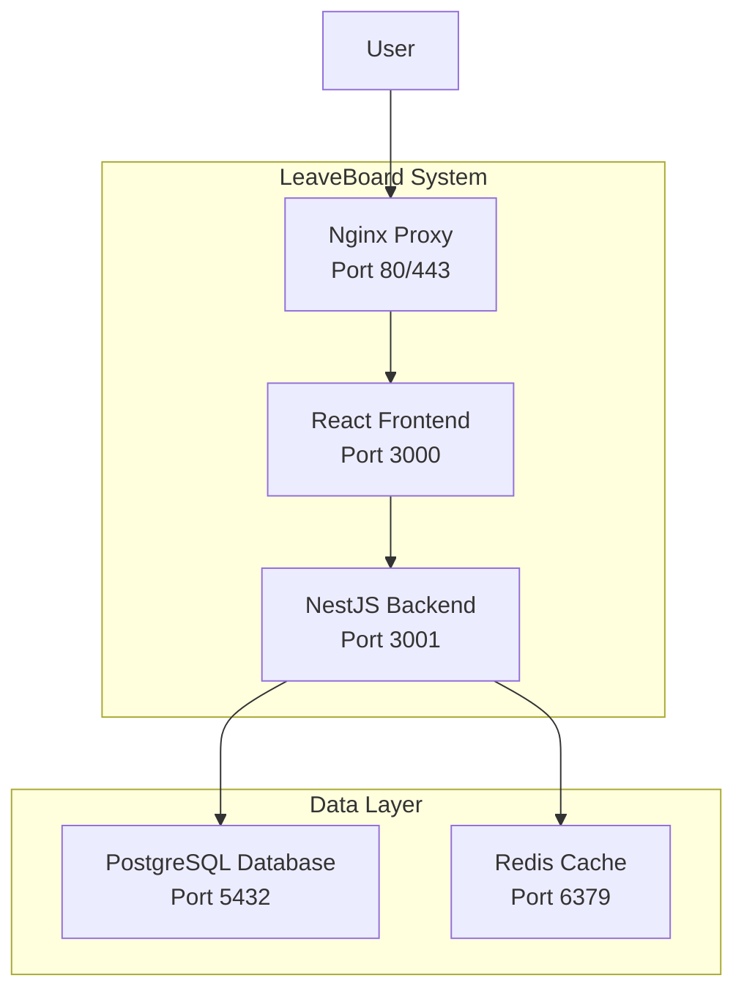

### 5.2 Level 2 - Backend Modules

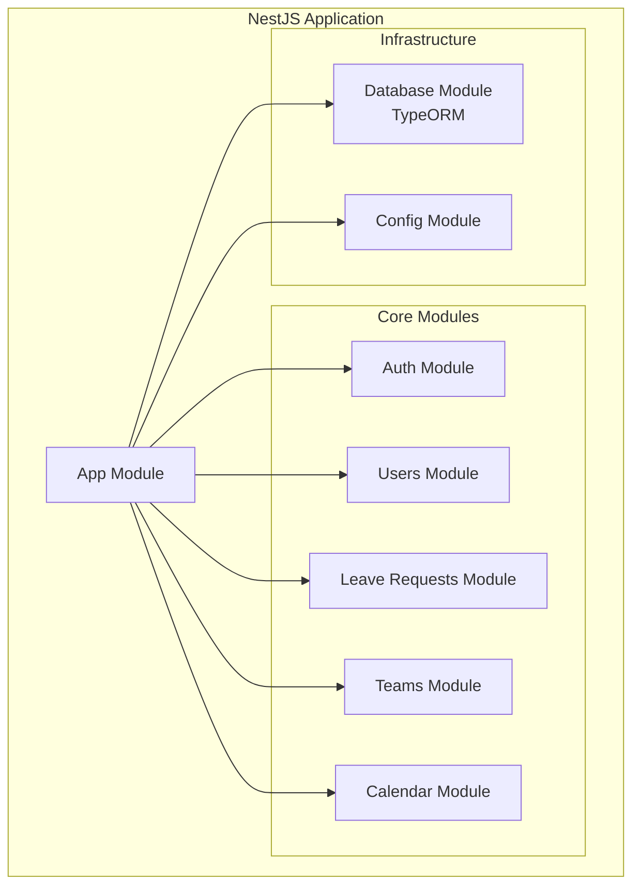

### 5.3 Level 3 - Frontend Structure

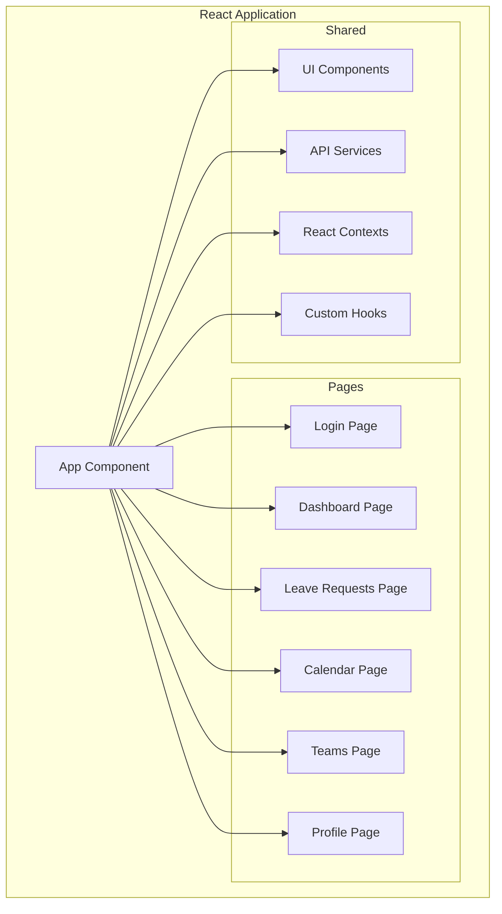

### 5.4 Component Responsibilities

#### Backend Modules

| Module | Responsibilities |
|--------|-----------------|
| **Auth Module** | User authentication, JWT token management, session handling |
| **Users Module** | User CRUD operations, profile management, leave balance calculations |
| **Leave Requests Module** | Leave request lifecycle, approval workflow, validation logic |
| **Teams Module** | Team structure management, hierarchy handling |
| **Calendar Module** | Calendar view data aggregation, availability calculations |

#### Frontend Components

| Component | Responsibilities |
|-----------|-----------------|
| **Pages** | Route-level components, layout orchestration |
| **UI Components** | Reusable interface elements, forms, displays |
| **API Services** | HTTP client setup, API endpoint abstractions |
| **Contexts** | Global state management (auth, theme, notifications) |
| **Custom Hooks** | Shared business logic, data fetching patterns |

---

## 6. Runtime View

### 6.1 User Authentication Flow

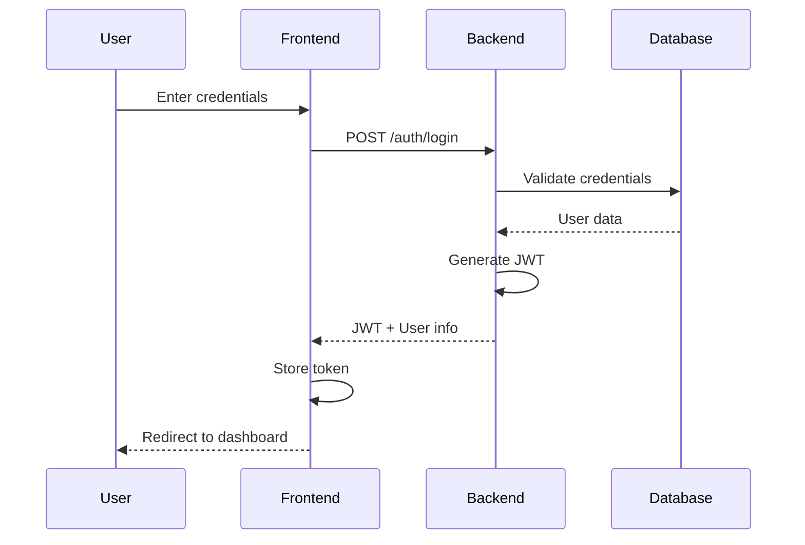

### 6.2 Leave Request Creation

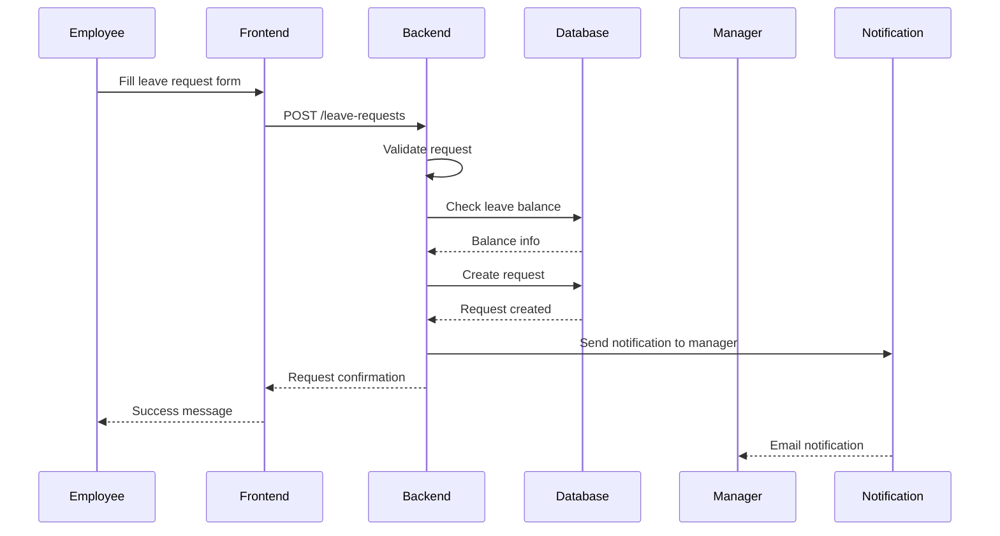

### 6.3 Leave Request Approval

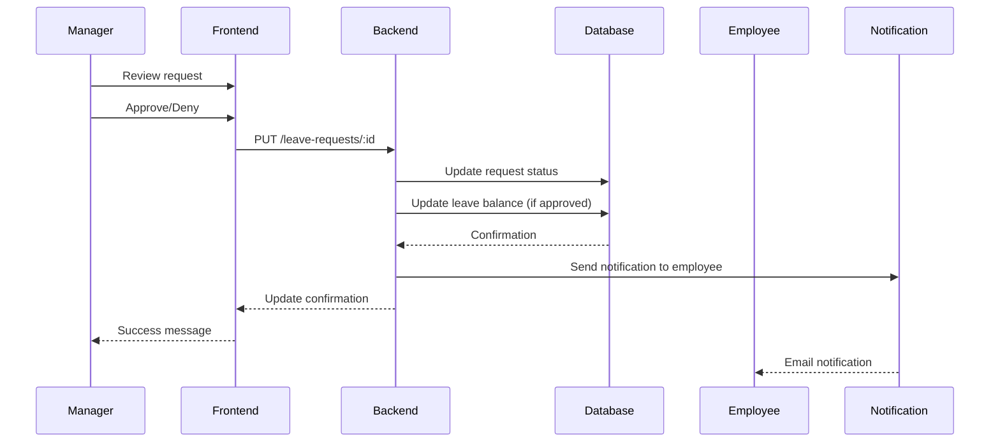

### 6.4 Calendar View Loading

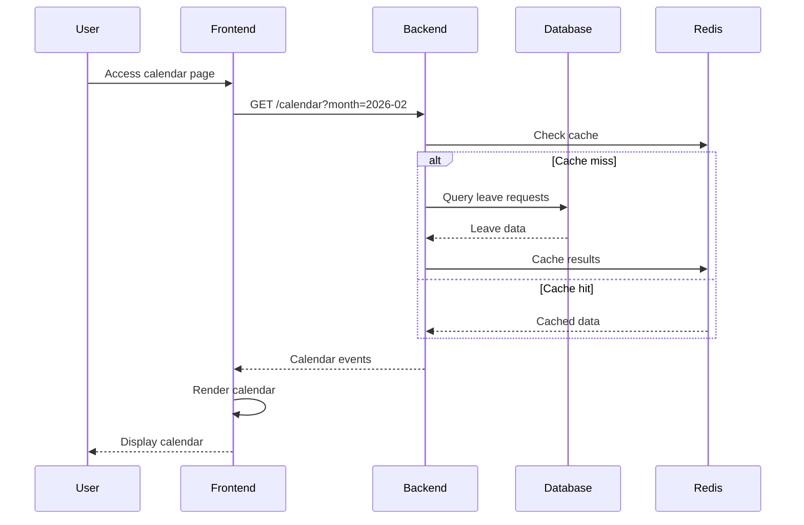

---

## 7. Deployment View

### 7.1 Development Environment

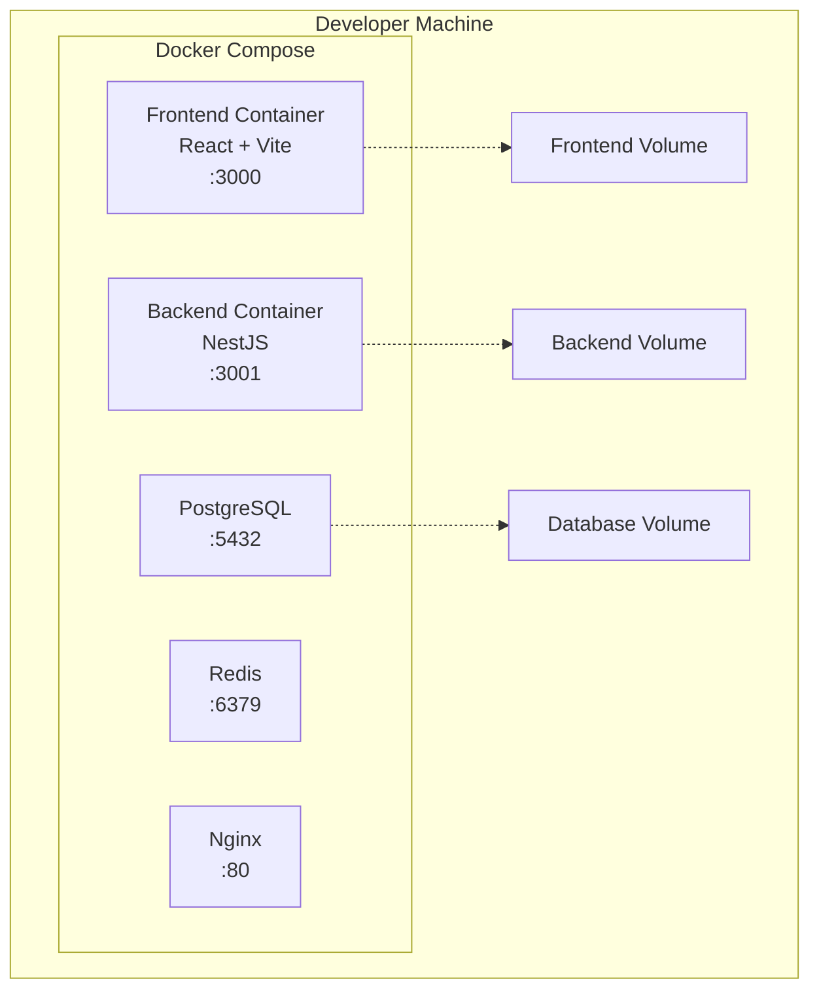

### 7.2 Production Environment (Recommended)

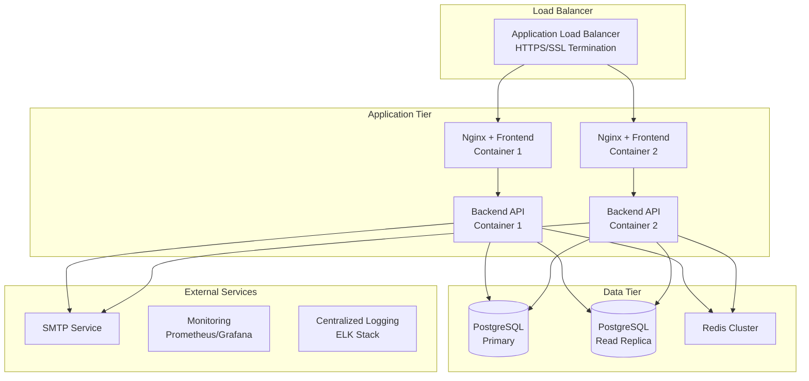

### 7.3 Infrastructure Mapping

#### Development Deployment
- **Orchestration**: Docker Compose
- **Networking**: Docker bridge network
- **Storage**: Named volumes for persistence
- **Configuration**: Environment files

#### Production Deployment Options

| Component | Technology Options | Recommendation |
|-----------|-------------------|----------------|
| **Container Orchestration** | Kubernetes, Docker Swarm, ECS | Kubernetes for scalability |
| **Database** | AWS RDS, Google Cloud SQL, Self-managed | Managed service (RDS/CloudSQL) |
| **Cache** | AWS ElastiCache, Redis Cloud, Self-managed | Managed Redis service |
| **Load Balancer** | AWS ALB, GCP Load Balancer, Nginx | Cloud provider ALB |
| **Storage** | S3, GCS, Azure Blob | Cloud object storage for files |
| **Monitoring** | Prometheus + Grafana, DataDog, New Relic | Prometheus for cost efficiency |

### 7.4 Security Considerations

| Layer | Security Measures |
|-------|-------------------|
| **Network** | HTTPS/TLS encryption, VPC isolation, Security groups |
| **Application** | JWT authentication, Input validation, CORS configuration |
| **Database** | Encrypted connections, Regular backups, Access controls |
| **Infrastructure** | Regular security updates, Secrets management, Audit logging |

---

## 8. Cross-cutting Concepts

### 8.1 Security

#### 8.1.1 Authentication & Authorization
- **JWT-based Authentication**: Stateless token authentication with configurable expiration
- **Role-based Access Control (RBAC)**: Four roles - Employee, Manager, HR, Admin
- **Route Protection**: Frontend route guards and backend API guards
- **Password Security**: bcrypt hashing with configurable salt rounds

#### 8.1.2 Data Protection
- **Input Validation**: Zod schemas for frontend, class-validator for backend
- **SQL Injection Prevention**: TypeORM parameterized queries
- **XSS Protection**: Output encoding, CSP headers
- **CORS Configuration**: Restricted origins in production

### 8.2 Error Handling

#### 8.2.1 Backend Error Handling
```typescript
// Global exception filter
@Catch()
export class GlobalExceptionFilter implements ExceptionFilter {
  catch(exception: unknown, host: ArgumentsHost) {
    // Log errors, return formatted responses
  }
}
```

#### 8.2.2 Frontend Error Handling
- **Error Boundaries**: React error boundaries for component crashes
- **API Error Handling**: Axios interceptors for consistent error processing
- **User Feedback**: Toast notifications for user-friendly error messages

### 8.3 Logging & Monitoring

#### 8.3.1 Application Logging
- **Structured Logging**: JSON format with correlation IDs
- **Log Levels**: DEBUG, INFO, WARN, ERROR
- **Sensitive Data**: Exclusion of passwords, tokens from logs

#### 8.3.2 Monitoring Points
- **Health Checks**: Database connectivity, Redis availability
- **Performance Metrics**: Response times, request rates
- **Business Metrics**: Leave request volumes, approval rates

### 8.4 Data Management

#### 8.4.1 Database Design Principles
- **Normalization**: 3rd normal form for relational integrity
- **Soft Deletes**: Maintain audit trail for deleted records
- **Timestamps**: Created/updated timestamps on all entities
- **Indexes**: Strategic indexing for query performance

#### 8.4.2 Data Validation
- **Input Sanitization**: XSS prevention, SQL injection protection
- **Business Rule Validation**: Leave balance checks, date validations
- **Data Consistency**: Database constraints and application-level checks

### 8.5 Configuration Management

- **Environment-based Config**: Separate configs for dev/staging/prod
- **Secret Management**: Secure handling of passwords, tokens
- **Feature Flags**: Toggle functionality without deployments
- **Runtime Configuration**: Hot-reloadable settings where possible

### 8.6 Internationalization (i18n)

- **Multi-language Support**: Prepared structure for future localization
- **Date/Time Formatting**: Locale-aware date handling with date-fns
- **Currency/Number Formatting**: Regional number formats
- **RTL Support**: CSS structure prepared for right-to-left languages

---

## 9. Architecture Decisions

### 9.1 ADR-001: Frontend Framework Selection

**Status**: Accepted
**Date**: 2026-01-15

#### Context
Need to select a frontend framework for building the LeaveBoard user interface.

#### Decision
Use React with TypeScript.

#### Alternatives Considered
1. **Vue.js 3**: Excellent developer experience, smaller learning curve
2. **Angular**: Enterprise features, full framework with CLI tools
3. **Svelte**: High performance, compile-time optimizations

#### Rationale
- Team familiarity with React ecosystem
- Large community and extensive library ecosystem
- Strong TypeScript integration
- Excellent job market and hiring prospects
- Mature tooling and development experience

#### Consequences
- **Positive**: Fast development, extensive libraries, strong community support
- **Negative**: Bundle size larger than Svelte, requires additional libraries for full framework features

---

### 9.2 ADR-002: Backend Framework Selection

**Status**: Accepted
**Date**: 2026-01-15

#### Context
Need to choose a backend framework for API development and business logic.

#### Decision
Use NestJS with TypeScript.

#### Alternatives Considered
1. **Express.js**: Minimal, flexible, large ecosystem
2. **Fastify**: High performance, schema-based validation
3. **Koa.js**: Modern async/await, minimalist design

#### Rationale
- Enterprise-ready features (DI, decorators, modules)
- TypeScript-first approach ensures type safety
- Built-in support for common enterprise patterns
- Excellent documentation and community
- Easy testing with built-in testing utilities

#### Consequences
- **Positive**: Scalable architecture, strong typing, enterprise features
- **Negative**: Steeper learning curve, more opinionated than Express

---

### 9.3 ADR-003: Database Selection

**Status**: Accepted
**Date**: 2026-01-15

#### Context
Choose a database system for persistent data storage.

#### Decision
Use PostgreSQL as the primary database.

#### Alternatives Considered
1. **MySQL**: Popular, well-supported, good performance
2. **MongoDB**: NoSQL flexibility, JSON-native storage
3. **SQLite**: Simplicity, zero-configuration, embedded

#### Rationale
- ACID compliance for data consistency
- Rich feature set (JSON support, full-text search, advanced indexing)
- Excellent TypeORM integration
- Strong performance for read/write workloads
- Open source with enterprise features

#### Consequences
- **Positive**: Data integrity, advanced features, good performance
- **Negative**: More complex than SQLite, requires separate service

---

### 9.4 ADR-004: Authentication Strategy

**Status**: Accepted
**Date**: 2026-01-20

#### Context
Need to implement user authentication and session management.

#### Decision
Use JWT tokens with Passport.js for authentication.

#### Alternatives Considered
1. **Session-based Auth**: Traditional server sessions with cookies
2. **OAuth 2.0 + OIDC**: External identity providers (Google, Microsoft)
3. **Auth0/Firebase**: Third-party authentication service

#### Rationale
- Stateless design enables horizontal scaling
- Frontend/mobile friendly
- Control over implementation and user data
- No vendor lock-in
- Standard approach for APIs

#### Consequences
- **Positive**: Scalable, standard approach, frontend-friendly
- **Negative**: Token management complexity, refresh token handling required

---

### 9.5 ADR-005: State Management Strategy

**Status**: Accepted
**Date**: 2026-01-22

#### Context
Choose state management approach for React frontend.

#### Decision
Use Zustand for client state + React Query for server state.

#### Alternatives Considered
1. **Redux Toolkit**: Powerful state management, predictable updates
2. **Context + useReducer**: Built-in React patterns
3. **Recoil**: Atomic state management, fine-grained updates

#### Rationale
- Simpler than Redux for most use cases
- React Query handles server state optimally
- Smaller bundle size
- Less boilerplate code
- TypeScript-friendly APIs

#### Consequences
- **Positive**: Simpler code, good performance, excellent DX
- **Negative**: Less mature ecosystem than Redux, fewer dev tools

---

### 9.6 ADR-006: Containerization Approach

**Status**: Accepted
**Date**: 2026-01-25

#### Context
Determine deployment and development environment strategy.

#### Decision
Use Docker with Docker Compose for development, support Kubernetes for production.

#### Alternatives Considered
1. **Virtual Machines**: Traditional VM-based deployment
2. **Serverless**: Functions-as-a-Service architecture
3. **Native Deployment**: Direct server installation

#### Rationale
- Consistent development and production environments
- Easy local development setup
- Container orchestration flexibility
- Good resource utilization
- Industry standard approach

#### Consequences
- **Positive**: Environment consistency, scalability options, industry standard
- **Negative**: Additional complexity, Docker knowledge required

---

## 10. Quality Requirements

### 10.1 Performance Requirements

| Requirement | Measure | Target | Priority |
|-------------|---------|---------|----------|
| **Page Load Time** | Time to interactive | < 2 seconds | High |
| **API Response Time** | 95th percentile | < 500ms | High |
| **Database Query Time** | Average query time | < 100ms | Medium |
| **Concurrent Users** | Simultaneous active users | 500 users | Medium |
| **Throughput** | Requests per second | 1000 RPS | Medium |

### 10.2 Scalability Requirements

| Aspect | Current Target | Future Target | Notes |
|--------|----------------|---------------|-------|
| **User Base** | 100-500 users | 10,000+ users | Horizontal scaling planned |
| **Data Volume** | 1M requests/year | 100M requests/year | Archive strategy needed |
| **Geographic Distribution** | Single region | Multi-region | CDN and data replication |

### 10.3 Availability Requirements

| Requirement | Target | Measurement Period | Downtime Allowance |
|-------------|--------|-------------------|-------------------|
| **System Availability** | 99.5% | Monthly | ~3.6 hours/month |
| **Planned Maintenance** | 2 hours/month | Monthly | Scheduled off-hours |
| **Recovery Time** | < 4 hours | Per incident | RTO requirement |
| **Recovery Point** | < 1 hour | Per incident | RPO requirement |

### 10.4 Security Requirements

| Category | Requirement | Implementation |
|----------|-------------|----------------|
| **Authentication** | Multi-factor authentication support | TOTP integration planned |
| **Authorization** | Role-based access control | Implemented with guards |
| **Data Encryption** | TLS 1.3 for data in transit | Nginx configuration |
| **Data At Rest** | Database encryption | PostgreSQL transparent encryption |
| **Audit Logging** | All user actions logged | Application-level logging |
| **Session Management** | Secure session handling | JWT with refresh tokens |

### 10.5 Usability Requirements

| Requirement | Target | Measurement |
|-------------|--------|-------------|
| **Learning Curve** | < 30 minutes | Time for new user to complete first leave request |
| **Error Recovery** | < 3 clicks | Steps to recover from common errors |
| **Accessibility** | WCAG 2.1 AA | Compliance level |
| **Mobile Support** | Responsive design | Support for mobile browsers |
| **Browser Support** | Modern browsers | Chrome, Firefox, Safari, Edge (last 2 versions) |

### 10.6 Maintainability Requirements

| Aspect | Requirement | Measure |
|--------|-------------|---------|
| **Code Coverage** | > 80% | Unit and integration tests |
| **Documentation** | Complete API docs | OpenAPI specification |
| **Code Quality** | Clean code standards | ESLint, SonarQube metrics |
| **Deployment Time** | < 15 minutes | Full production deployment |
| **Rollback Time** | < 5 minutes | Production rollback capability |

---

## 11. Risks and Technical Debts

### 11.1 Technical Risks

#### 11.1.1 High Priority Risks

| Risk | Probability | Impact | Mitigation Strategy |
|------|------------|--------|-------------------|
| **Database Performance Degradation** | Medium | High | Query optimization, read replicas, connection pooling |
| **Security Vulnerabilities** | Medium | High | Regular security audits, dependency updates, penetration testing |
| **Third-party Service Failures** | High | Medium | Circuit breakers, fallback mechanisms, service monitoring |
| **Data Loss** | Low | Critical | Automated backups, disaster recovery procedures, data validation |

#### 11.1.2 Medium Priority Risks

| Risk | Probability | Impact | Mitigation Strategy |
|------|------------|--------|-------------------|
| **Frontend Performance Issues** | Medium | Medium | Code splitting, lazy loading, performance monitoring |
| **Integration Complexity** | Medium | Medium | API versioning, contract testing, sandbox environments |
| **Team Knowledge Gaps** | Medium | Medium | Documentation, knowledge sharing sessions, code reviews |
| **Technology Obsolescence** | Low | Medium | Regular technology reviews, migration planning |

### 11.2 Technical Debt

#### 11.2.1 Current Technical Debt

| Debt Item | Impact | Effort to Fix | Priority |
|-----------|--------|---------------|----------|
| **Missing Frontend Pages** | High | 2-3 weeks | Critical |
| **Incomplete Error Handling** | Medium | 1 week | High |
| **Limited Test Coverage** | Medium | 2 weeks | High |
| **Missing API Documentation** | Low | 3 days | Medium |
| **Hardcoded Configuration** | Low | 1 week | Medium |

#### 11.2.2 Planned Technical Debt

| Future Debt | Rationale | Timeline to Address |
|-------------|-----------|-------------------|
| **Monolithic Architecture** | Current simplicity needed for MVP | 6-12 months (microservices migration) |
| **Basic Caching Strategy** | Performance acceptable for current scale | 3-6 months (advanced caching) |
| **Limited Monitoring** | Core functionality priority | 2-3 months (comprehensive monitoring) |

### 11.3 Business Risks

| Risk | Impact | Mitigation |
|------|--------|------------|
| **User Adoption Challenges** | Low usage, failed ROI | User training, feedback loops, iterative improvements |
| **Compliance Requirements** | Legal/audit issues | Regular compliance reviews, audit trails, data protection |
| **Integration Failures** | Limited value from existing systems | Phased integration approach, fallback procedures |
| **Scalability Bottlenecks** | Poor performance under load | Performance testing, scaling plans, monitoring |

### 11.4 Risk Monitoring

| Risk Category | Key Indicators | Monitoring Frequency |
|---------------|----------------|---------------------|
| **Performance** | Response times, error rates, user complaints | Real-time dashboards |
| **Security** | Failed login attempts, suspicious activities | Daily review |
| **Technical** | Build failures, test coverage, code quality | Every commit |
| **Business** | User engagement, feature usage, feedback | Weekly reports |

---

## 12. Glossary

| Term | Definition |
|------|------------|
| **Annual Leave** | Paid vacation time allocated to employees annually |
| **Approval Workflow** | Process by which leave requests are reviewed and approved/denied |
| **Leave Balance** | Remaining available leave days for an employee |
| **Leave Request** | Formal request by employee for time off |
| **Manager** | Employee with authority to approve/deny leave requests |
| **Role-Based Access Control (RBAC)** | Security model that restricts access based on user roles |

### Technology Terms

| Term | Definition |
|------|------------|
| **ARC42** | Architecture documentation template with 12 standardized sections |
| **Docker** | Containerization platform for application deployment |
| **JWT** | JSON Web Token, a standard for secure authentication |
| **NestJS** | Progressive Node.js framework for building efficient server-side applications |
| **PostgreSQL** | Advanced open-source relational database system |
| **React** | JavaScript library for building user interfaces |
| **Redis** | In-memory data structure store used as cache |
| **REST API** | Representational State Transfer application programming interface |
| **TypeORM** | Object-relational mapping library for TypeScript and JavaScript |
| **TypeScript** | Strongly typed programming language that builds on JavaScript |

### Business Terms

| Term | Definition |
|------|------------|
| **Employee Self-Service** | System capability allowing employees to manage their own requests |
| **HR** | Human Resources department |
| **Leave Policy** | Company rules governing time off entitlements and procedures |
| **Sick Leave** | Time off for health-related reasons |
| **Team Calendar** | Shared view of team member availability and planned absences |

---

**Document History**

| Version | Date | Author | Changes |
|---------|------|--------|---------|
| 1.0 | 2026-02-05 | Development Team | Initial architecture document |

**Review Schedule**

| Review Type | Frequency | Next Review |
|-------------|-----------|-------------|
| **Technical Review** | Quarterly | 2026-05-05 |
| **Business Alignment** | Bi-annual | 2026-08-05 |
| **Security Review** | Annual | 2027-02-05 |

---

*This document follows the ARC42 template for architecture documentation. For questions or updates, please contact the development team.*